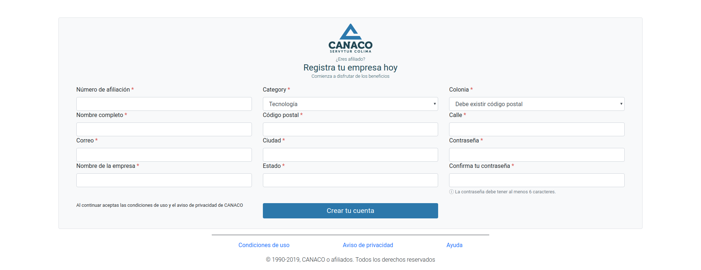

# Usage

## Index

- [Sign up and Sign in](#Sign-up-and-Sign-in)
- [Request a product](#Request-a-product)
- [Offer a product](#Offer-a-product)
- [Respond to a request](#Respon-to-a-request)
- [Search a product](#Search-a-product)

## Sign up and Sign in

Once you're in the home page, open the dropdown menu *"Mi cuenta"* and click on *"Identifícate"* button.

### If you don't have an account:

In the login page, you'll see the *"Crear tu cuenta"* button, click there to register yourself.

\
On the sign up view, you'll need complete all the fields with your info and your company info. Make sure of complete the fields with red asterisks.

\
Once completed the register, the system will send you an automatic message in your email to confirm your account.

## If you have an account:

In the login page, you need complete the fields with your credentials and click in the *"Iniciar sesión"* button, to login with your account.

## Request a product

Once you're logged in, click on the dropdown and choose the "Compras" option to open the form and request a product.

\
First you need to choose the product category that you're looking for.

\
Then choose a subcategory for your request.

\
At this point, you'll need to complete the form to detail the required product, the name, description, quantity and its unit of measurement.

\
When the register is complete, you'll be redirected to the Categories page.

## Offer a product

To offer a product, click on the dropdown and choose the "Vender" option.

Then you need to follow the firsts 2 steps from [Request a product](#Request-a-product), after choose the category and subcategory, you'll get a form to complete the features of the product.

## Respond to a request

When a customer requests a product of your category registered, you'll get a notification to respond to his request, and you can click there to access the chat with the user.

\
In the chat page, you can set a conversation with the applicant, and get to an agreement about the sale. Also, you can see the details of the user like name, company and opinions.

## Search a product

If you want to search a product, you can use the search bar in the navbar, and search it by name. Don't worry about how you write the name, the system can make a search with lower case or capital letter and find coincidences with your election.

\
Also you can search by category, you only need open the "Categorías", pick a category and then click one of the subcategories, or the title if you want a general search of the category.

